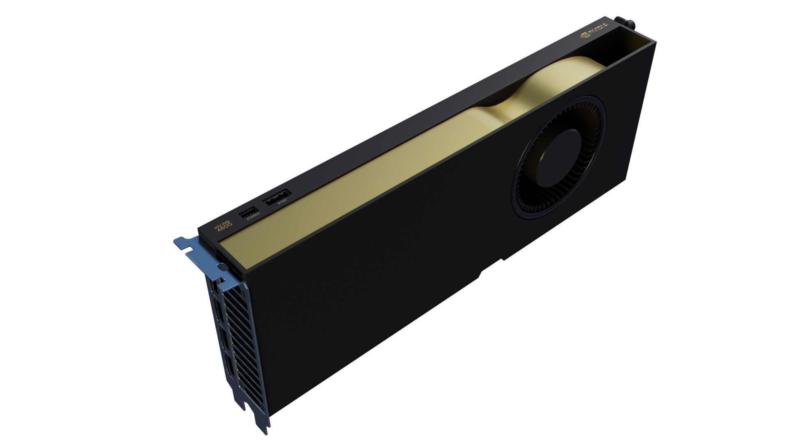
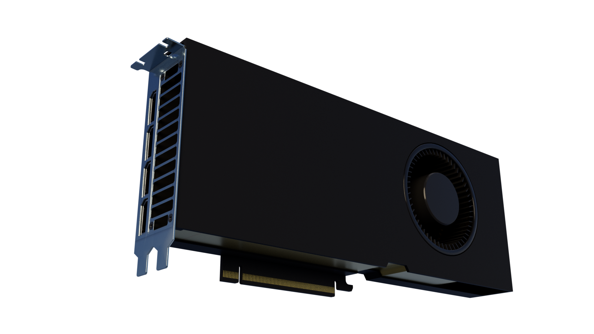

# Case 03: The "Forced-Flow" Inference Refinery

> [!WARNING]
> **Work in Progress:** This project is currently under active development. Some links and assets may be placeholders.

---

## 📋 Project Overview

A **Reproducible Tech Pack** demonstrating an **L1 Digital Twin** of an AI Inference Farm.
The project visualises a **"Viral Inference Surge"** — a dynamic stress-test scenario where a sudden 500% spike in AI model requests triggers a sequential ramp-up of cooling and power systems across a high-density data hall.

> **Why GB203, not the flagship?** The **RTX PRO 4500** delivers **17.9 TFLOPS per $1,000** — the best efficiency ratio at this tier. Across a 16-rack cluster, this translates to **$1.58M saved** versus the RTX PRO 5000 72GB, with no compromise on the architecture: the 4U chassis accepts a drop-in upgrade the moment VRAM requirements scale. *(The RTX PRO 6000's 600W TDP requires a different node class entirely.)*
>
> → [Architecture & Physics](./docs/knowledge_base/main_concept.md) · [Hardware Specification](./docs/knowledge_base/hardware_specification.md)

Unlike traditional linear animation, this ecosystem is a **State Machine**. It simulates the facility's physical response in real-time based on normalised telemetry data.

## RTX PRO 4500 Hero Asset

*Procedural modeling & texturing of the Blackwell GB203 node.*

| | | | |
| :---: | :---: | :---: | :---: |
|  |  |  |  |
| *RTX PRO 4500 Blackwell - 01* | *RTX PRO 4500 Blackwell - 02* | *RTX PRO 4500 Blackwell - 03* | *RTX PRO 4500 Blackwell - 04* |

### Key Features

| Feature | Description |
| :--- | :--- |
| **The Glass Tube (Rack)** | **Sealed Containment:** Racks feature hermetic glass doors and bottom-fed plenums, forcing cold air *through* the nodes. |
| **The Silent Heat (Node)** | **Precision Thermal Modelling:** Tracks waste heat from the **1600W PSU (~84W)** alongside the **3x GB203** array. |
| **Metrics** | Real-time tracking of **PUE** (Facility) and **CEF** (Cooling Efficiency Factor) at the rack level. |
| **Hybrid Visualisation** | Seamless switching between **Photorealistic** (Marketing) and **X-Ray / Fluid Dynamics** (Engineering) modes. |

---

## 🏗️ Architecture

The system follows a strict separation of concerns:

### 1. The Factory (SideFX Houdini)

*Geometry authoring, simulation, and USD export.*

Houdini is the closed creative environment of this hybrid pipeline. Houdini project files (`.hip`) are **not distributed** — only the exported outputs are.

* **Geometry**: Server Nodes, Racks, and Data Hall layouts modelled procedurally and exported as USD.
* **Simulation**: CFD thermal and airflow dynamics computed in Houdini, baked to **VDB caches**. Playback and visualisation of these caches happens inside the Omniverse Extension.
* **Output**: Optimised USD assets (`.usda`, `.vdb`) consumed by the App at runtime.

### 2. The App (NVIDIA Omniverse)

*Runs the runtime logic and visualisation.*

* **Extension**: `omni.ai.refinery` (Custom Kit App).
* **Logic**: Listens to the Data Provider and swaps USD VariantSets based on the current State.
* **UI**: Custom Control Panel for manual state override.

---

## 🚦 State Matrix

The Digital Twin operates in one of four discrete states at any given time:

| State | Load | Visual Cues |
| :--- | :--- | :--- |
| **Idle** | 0% | Laminar airflow, cool ambient lighting, minimal power draw. |
| **Nominal** | 25% | Steady-state cooling, efficient PUE, green status LEDs. |
| **Surge** | 50% | Fans ramping up, heat signatures visible on exhaust vents. |
| **Critical** | 85% | Thermal throttling, turbulent airflow (Heat haze), red warning LEDs. |

*The **Viral Inference Surge** scenario drives the transition cascade: `Nominal → Surge → Critical`.*

---

## 🛠️ Usage & Setup

### 1. Environment Setup

The project relies on a specific Conda environment (`case03-env`) to ensure reproducibility.

```bash
# Create and activate environment
conda create -n case03-env python=3.10
conda activate case03-env

# Install dependencies
pip install -r requirements.txt
```

### 2. Asset Hydration

To keep the repository lightweight, heavy binary assets (Textures, VDB Caches) are stored externally.

1. **Download** the Asset Pack: `[LINK_TBD]`
2. **Extract** contents to: `assets/_external/`
3. **Verify** structure:

    ```text
    assets/_external/
    ├── usd/      # Heavy USD Crates
    ├── tex/      # 4K/8K Textures
    └── vdb/      # Simulation Caches
    ```

### 3. Running the App

> *Coming Soon: Instructions for launching the Omniverse Extension*

---

## 📂 Repository Structure

```text
.
├── assets/
│   ├── _external/   # [GIT-IGNORED] Downloaded binary assets
│   └── local/       # Lightweight git-tracked assets (UI icons, scripts)
├── docs/            # Documentation & ADRs
│   ├── knowledge_base/  # Concept, Specs & Engineering Rules
│   │   ├── main_concept.md
│   │   ├── hardware_specification.md
│   │   └── usd_architecture/ # Rigid OpenUSD Pipeline Guidelines
│   ├── plans/           # Actionable implementation guides
│   │   └── case 03 - tech debt.md
│   └── adr/             # Architecture Decision Records (e.g., 007 USD Pipeline)
├── src/             # Python source code (Data Provider, Logic)
└── tools/           # Developer scripts (Jira integration, asset validation)
```

## 📜 Technical Stack

* **Python**: 3.10
* **USD**: 23.11+
* **Houdini FX**: 21.0.596
* **NVIDIA Omniverse / Isaac Sim**: 5.1.0

---

## 📜 Changelog

* **2026-01-22:** Initial repository bootstrap. Established Readme-driven structure: Tech Pack, ADR documentation, pre-commit hooks, and `case03-env` constraints.
* **2026-02-01:** Finalized Case 03 core concept (AI Inference Refinery) and hardware specification (Blackwell Rig v1.0).
* **2026-02-09:** Focused development on Hero Asset (Blackwell Rig v1.0), detailing the server front panel and cooler chassis. Implemented external storage strategy (ADR 005).
* **2026-02-16:** Dedicated sprint to Blackwell Rig GB203 detailing. Standardized asset naming conventions and updated cooling concepts (Forced-Flow & Metrics).
* **2026-02-23:** Completed blockout of ConnectX-7 NIC and outer chassis panels. Initiated blockout for RTX PRO 4500 GPUs and ASUS Pro WS WRX90E-SAGE SE motherboard.
* **2026-03-01:** Completed modeling of RTX PRO 4500 Blackwell, baked textures, and successfully exported the USD asset to the `..\assets\_external\usd\rtx_pro_4500` directory.
