# Blackwell Monitoring Suite

> [!WARNING]
> **Work in Progress:** This project is currently under active development. Some links and assets may be placeholders.

---

## 📋 Project Overview

**Blackwell Monitoring Suite** is the Case 03 runtime and technical showreel
application for presenting a high-density Blackwell inference data hall through
hydrated OpenUSD assets, synthetic telemetry, and staged Omniverse runtime
capabilities.

A **Reproducible Tech Pack** demonstrating a High-Fidelity **L1 Digital Twin** of an AI Inference Farm.
The current repository validates the first production stages of the lifecycle: *Geometry Foundation → Houdini Simulation Cache → USD/OpenVDB Packaging*. The planned runtime stages are documented as architecture contracts and WIP implementation notes: *Synthetic Telemetry → State Switching → Omniverse Visualisation*.

The project visualises a **"Viral Inference Surge"** — a dynamic stress-test scenario where a sudden 500% spike in LLM requests triggers a sequential ramp-up of cooling and power systems across a high-density data hall.

> **Why GB203, not the flagship?** The **RTX PRO 4500** delivers **17.9 TFLOPS per $1,000** — the best efficiency ratio at this tier. Across a 16-rack cluster, this translates to **$1.58M saved** versus the RTX PRO 5000 72GB, with no compromise on the architecture: the 4U chassis accepts a drop-in upgrade the moment VRAM requirements scale. *(The RTX PRO 6000's 600W TDP requires a different node class entirely.)*
>
> **Why 3 GPUs, not 4?** The node requires a 400G ConnectX-7 NIC for RDMA. On the 7-slot WRX90E motherboard, three dual-slot GPUs + one NIC perfectly maxes out the physical PCIe layout without bottlenecking the network card.
>
> → [📚 Knowledge Base Hub (Index)](./docs/knowledge_base/README.md) · [Architecture & Physics](./docs/knowledge_base/main_concept.md) · [Hardware Specification](./docs/knowledge_base/hardware_specification.md)

Unlike traditional linear animation, this ecosystem is structured as a **State Machine**. Runtime telemetry drives interactive visual responses: precomputed airflow caches, streamlines, heatmaps, lighting, and HUD cues can switch by operational state instead of being locked to a fixed shot.

> [!NOTE]
> Synthetic Data Generation for Sim-to-Real: No real data centre required. All metrics (GPU temps, fan RPMs, power draw) are generated procedurally by the Data Provider module to create high-quality demonstration data. This proves the full pipeline end-to-end before physical deployment.
> **Want a real Digital Twin?** The `Data Provider` exposes a standard interface — swap the synthetic generator for any real monitoring feed (HWiNFO64, Grafana, MQTT, Kafka) and the entire visualisation layer works unchanged. This is the designed upgrade path for anyone adapting this Tech Pack to their own infrastructure.

## Blackwell Rig Airflow Simulation Preview

*Technical viewport preview of the 4U Blackwell Rig GB203 node used as the first airflow layout validation pass.*

The current simulation pass turns the hero server from a static hardware model into a testable airflow volume: chassis intake, rear exhaust, GPU bodies, CPU cooler, PSU mass, cable bundles, and internal obstructions are all evaluated inside the same simulation domain.

These Houdini-solved airflow caches are the Demo Mode input for the runtime contract: a controlled, reproducible source for previewing how the node responds across telemetry-driven states under local hardware and demonstration constraints. They are not presented as a validated CFD benchmark; the goal is a qualitative engineering visualisation layer that makes intake paths, component occlusion, recirculation zones, heat-source proxies, and operational state changes legible.

The Blackwell Monitoring Suite runtime is intentionally cache/live agnostic: the same visualisation layer can consume precomputed VDB sequences for Demo Mode or externally generated live volumetric/vector-field data for a future Live Mode. In that sense, cached airflow plays the same role as synthetic telemetry: it proves the pipeline now without narrowing the final digital-twin architecture.

→ [Watch the airflow preview video](https://youtu.be/lDswlLGkTQ8?si=JAtLdAwG9q-KcYMw)

→ See also: [Rack Airflow Budget](./docs/knowledge_base/rack_airflow_budget.md)

| | | | |
| :---: | :---: | :---: | :---: |
| 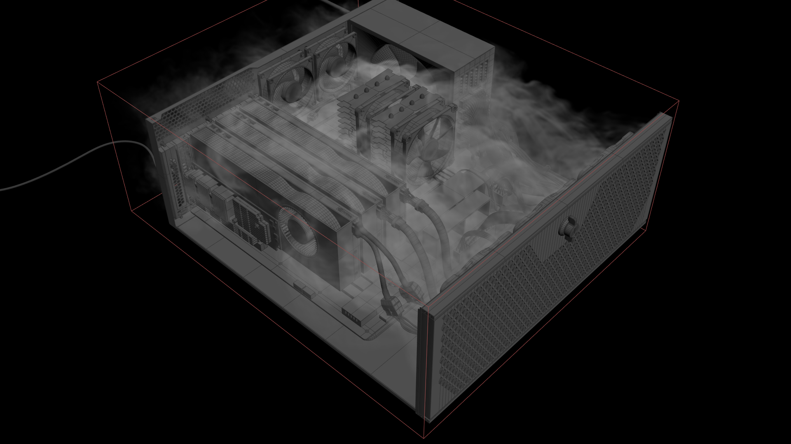 | 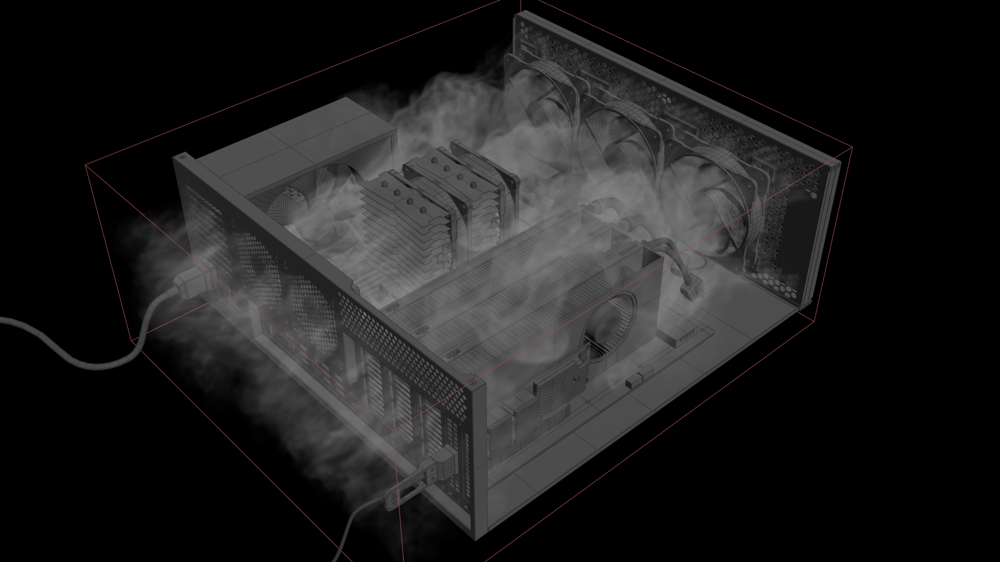 | 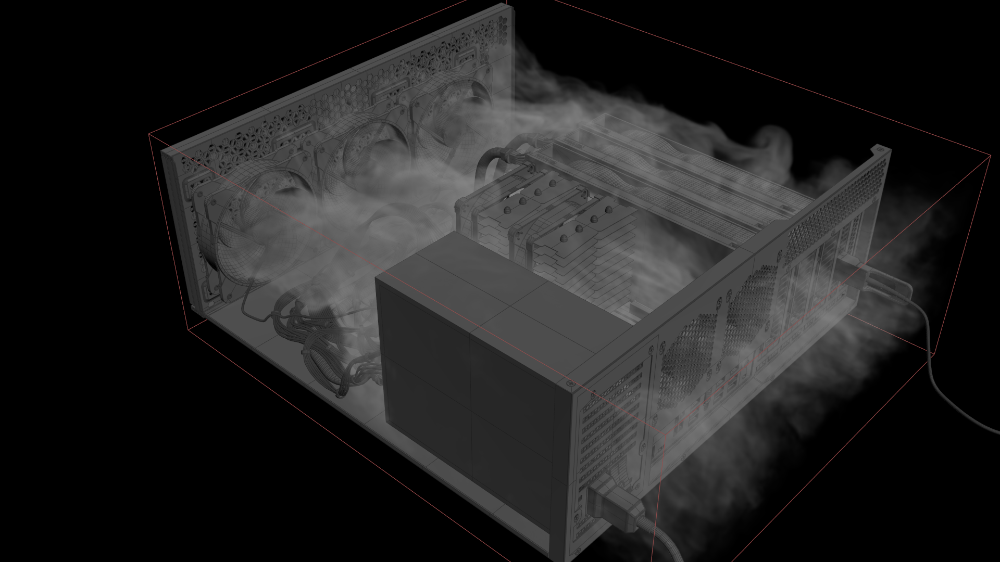 | 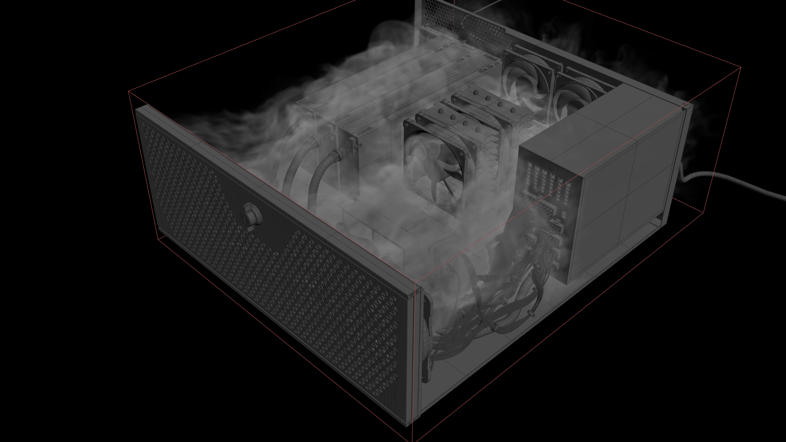 |
| *Simulation domain / intake view* | *Internal airflow obstruction pass* | *Rear exhaust and fan interaction* | *Cable-side airflow validation* |

The streamline visualisation pass exposes the velocity-field behaviour more directly, showing the fan-driven flow paths, cooler interactions, exhaust directionality, and turbulence around internal cable and component obstructions.

| | | | |
| :---: | :---: | :---: | :---: |
| 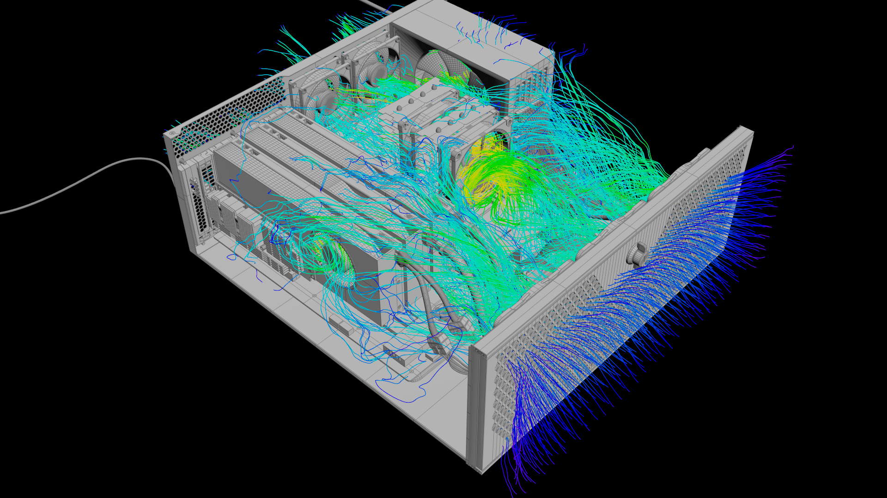 | 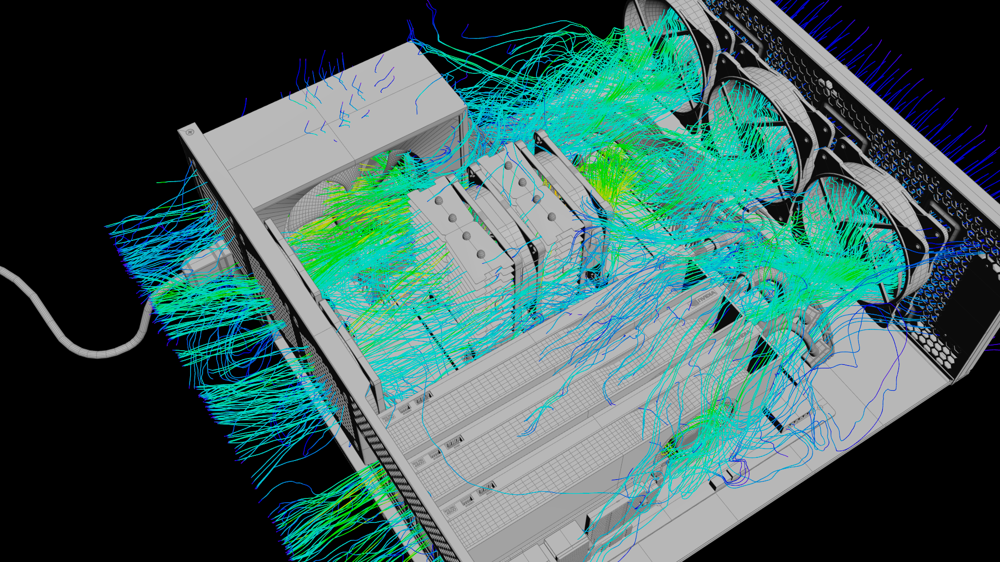 | 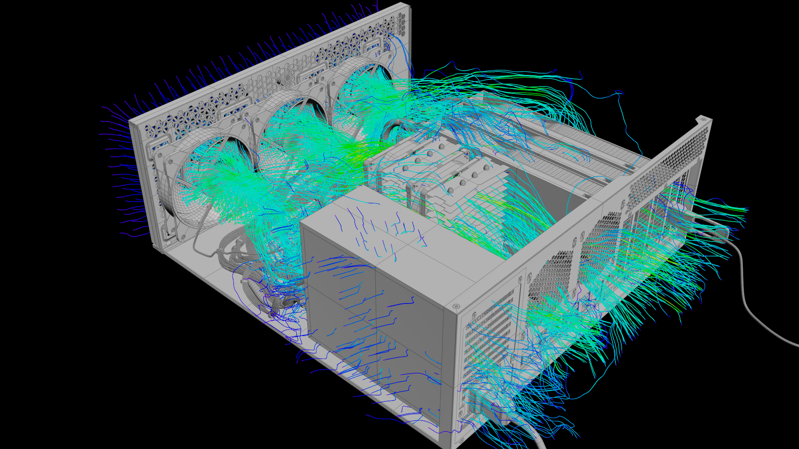 | 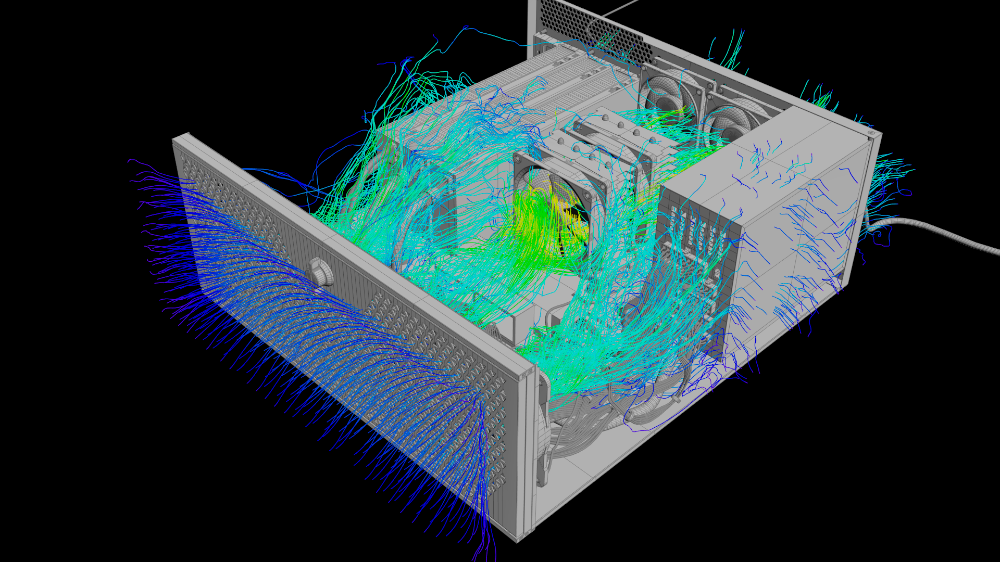 |
| *Velocity field overview* | *CPU cooler and rear fan flow paths* | *Rear exhaust directionality* | *Cable-side turbulence and intake/exhaust flow* |

## RTX PRO 4500 Hero Asset

*Procedural modelling & texturing of the Blackwell GB203 node.*

| | | | |
| :---: | :---: | :---: | :---: |
|  |  |  |  |
| *RTX PRO 4500 Blackwell - 01* | *RTX PRO 4500 Blackwell - 02* | *RTX PRO 4500 Blackwell - 03* | *RTX PRO 4500 Blackwell - 04* |

## ConnectX-7 Hero Asset

*Procedural modelling & texturing of the 400G NDR network interface card.*

| | | | |
| :---: | :---: | :---: | :---: |
|  |  |  |  |
| *ConnectX-7 - 01* | *ConnectX-7 - 02* | *ConnectX-7 - 03* | *ConnectX-7 - 04* |

## ASUS Pro WS WRX90E-SAGE SE Hero Asset

*Procedural modelling & texturing of the WRX90E motherboard.*

| | | | |
| :---: | :---: | :---: | :---: |
|  |  |  |  |
| *ASUS Pro WS WRX90E-SAGE SE - 01* | *ASUS Pro WS WRX90E-SAGE SE - 02* | *ASUS Pro WS WRX90E-SAGE SE - 03* | *ASUS Pro WS WRX90E-SAGE SE - 04* |

## Noctua NH-D9 TR5-SP6 Hero Asset

*Procedural modelling & texturing of the 4U Threadripper CPU cooler.*

| | | | |
| :---: | :---: | :---: | :---: |
|  |  |  |  |
| *Noctua NH-D9 - 01* | *Noctua NH-D9 - 02* | *Noctua NH-D9 - 03* | *Noctua NH-D9 - 04* |

## be quiet! Dark Power Pro 13 1600W Hero Asset

*Procedural modelling & texturing of the Titanium 1600W PSU.*

| | | | |
| :---: | :---: | :---: | :---: |
| 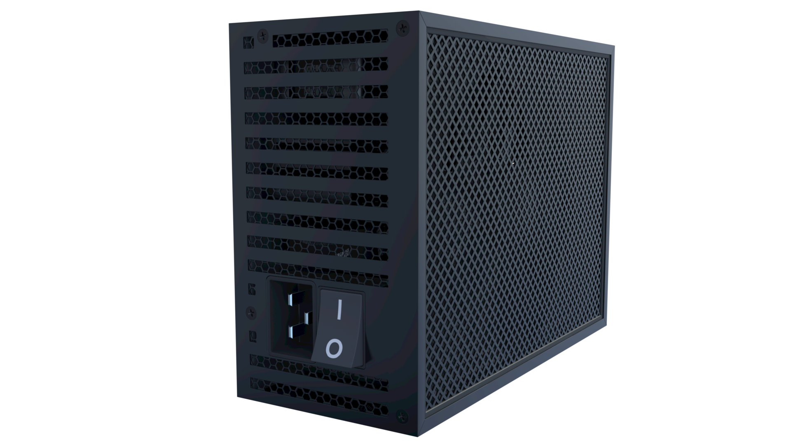 | 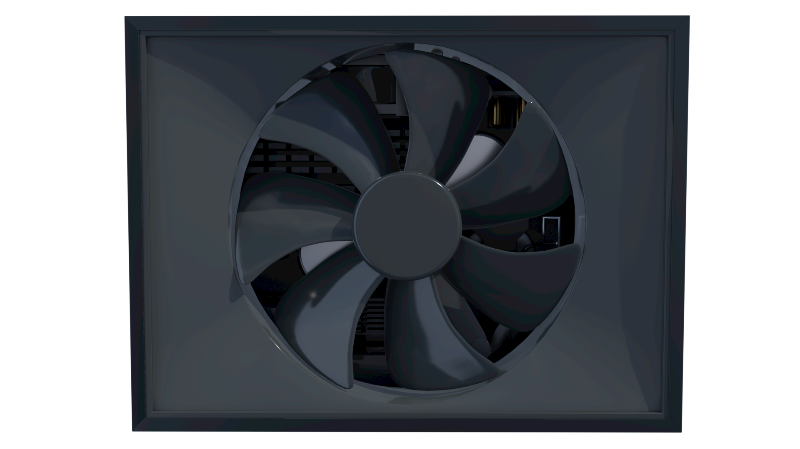 | 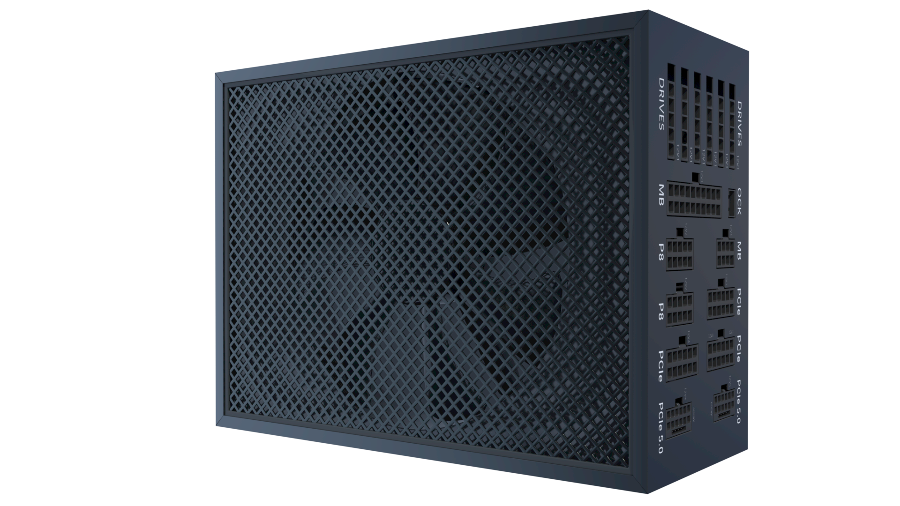 | 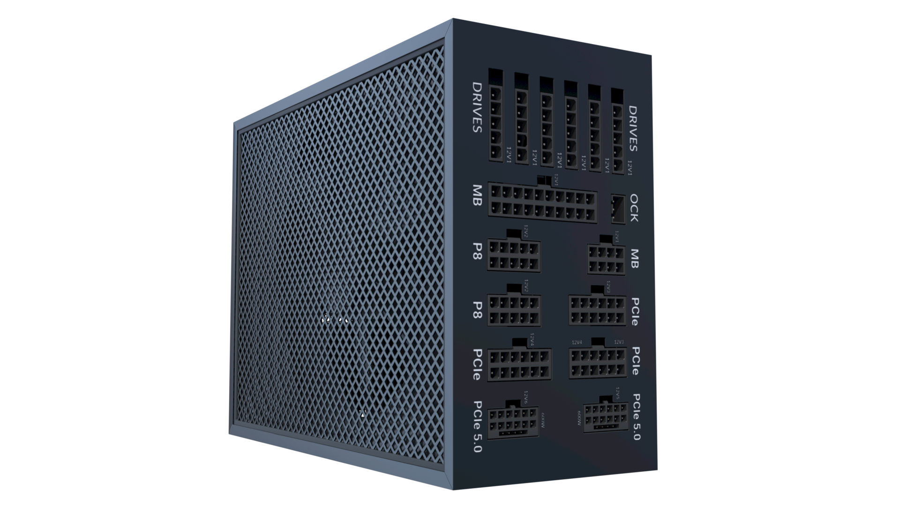 |
| *be quiet! Dark Power Pro 13 - 01* | *be quiet! Dark Power Pro 13 - 02* | *be quiet! Dark Power Pro 13 - 03* | *be quiet! Dark Power Pro 13 - 04* |

## SilverStone RM44 Chassis Hero Asset

*Procedural modelling & texturing of the 4U industrial server chassis.*

| | | | |
| :---: | :---: | :---: | :---: |
| 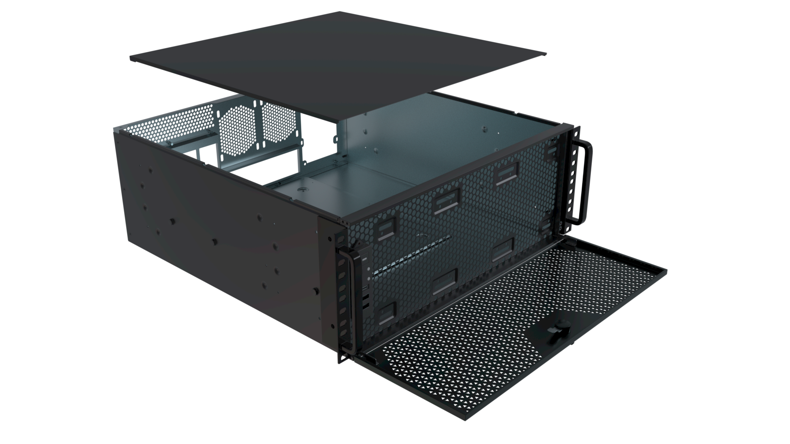 | 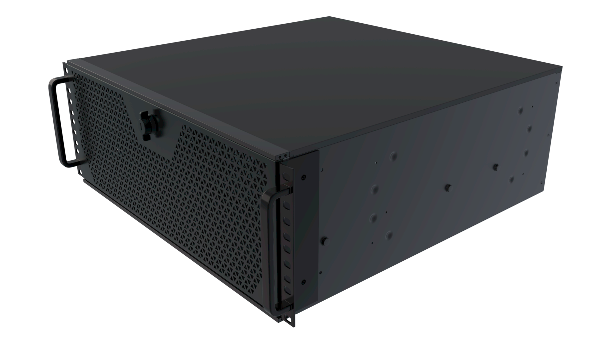 | 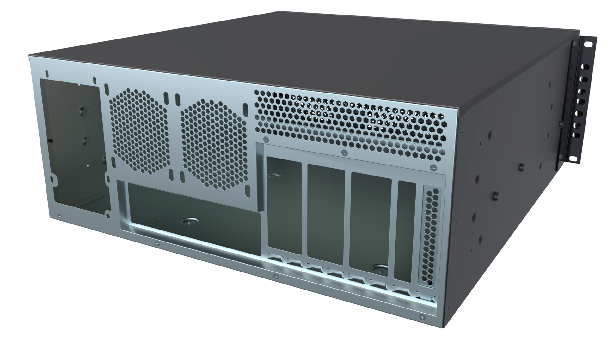 | 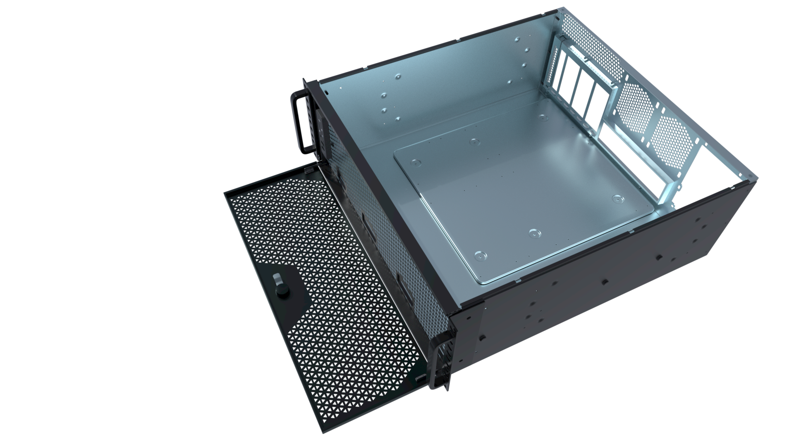 |
| *SilverStone RM44 - 01* | *SilverStone RM44 - 02* | *SilverStone RM44 - 03* | *SilverStone RM44 - 04* |

### Key Features

| Feature | Description |
| :--- | :--- |
| **The Glass Tube (Rack)** | **Sealed Containment:** Racks feature hermetic glass doors and bottom-fed plenums, forcing cold air *through* the nodes. |
| **The Silent Heat (Node)** | **Precision Thermal Modelling:** Tracks waste heat from the **1600W PSU (~84W)** alongside the **3x GB203** array. |
| **Metrics** | Real-time tracking of **PUE** (Facility) and **CEF** (Cooling Efficiency Factor) at the rack level. |
| **Hybrid Visualisation** | Seamless switching between **Photorealistic** (Marketing) and **X-Ray / Fluid Dynamics** (Engineering) modes. |

---

## 🏗️ Architecture

The system follows a strict separation of concerns:

### 1. Geometry Foundation & Production Simulation (SideFX Houdini)

*Geometry authoring, simulation, and USD export.*

Houdini is the closed creative environment of this hybrid pipeline. Houdini project files (`.hip`) are **not distributed** — only the exported outputs are.

* **Geometry**: Server Nodes, Racks, and Data Hall layouts modelled procedurally and exported as USD.
* **Simulation**: Houdini-based volumetric airflow and thermal-behaviour approximation, baked to **VDB caches**. Playback and visualisation of these caches is planned for the Blackwell Monitoring Suite runtime layer.
* **Output**: Optimised USD assets (`.usda`, `.vdb`) prepared for runtime consumption by Blackwell Monitoring Suite.

### 2. Interactive Digital Twin Frontend (NVIDIA Omniverse)

*The real-time visualisation layer and state machine.*

* **Application**: **Blackwell Monitoring Suite**.
* **Extension**: `msp.bw.monitoring`.
* **Logic**: A robust State Machine that listens to the Python Data Provider, dynamically swapping pre-cached USD VariantSets (Pyro sims, vector streamlines, thermal heatmaps) based on the active operational state.
* **UI**: Viewport-embedded HUD (`omni.ui.scene` overlay) for hierarchical LOD navigation (Hall → Rack → Node) and manual stress-test overrides.

---

## 🚦 State Matrix

The planned runtime operates in one of four synthetic workload states. These
are demo/monitoring loads, not literal power-off percentages; even the minimum
operational state keeps the server active.

| State | Synthetic Load | Visual Cues |
| :--- | :--- | :--- |
| **Idle** | 25% | Minimum operational baseline, laminar airflow, cool ambient lighting, low power draw. |
| **Nominal** | 50% | Steady-state cooling, efficient PUE, stable green status LEDs. |
| **Surge** | 75% | Fans ramping up, stronger heat signatures visible on exhaust vents. |
| **Critical** | 96% | Near-saturation load, thermal-risk cues, turbulent airflow, red warning LEDs. |

*The **Viral Inference Surge** scenario drives the transition cascade: `Nominal → Surge → Critical`.*

---

## 🛠️ Usage & Setup

### 1. Environment Setup

The project relies on a specific Conda environment (`case03-env`) to ensure reproducibility.

```bash
# Create and activate environment
conda create -n case03-env python=3.11.15
conda activate case03-env

# Install dependencies
pip install -r requirements.txt
```

### 2. Asset Hydration

To keep the repository lightweight, heavy binary assets (Textures, VDB Caches) are stored externally.

1. **Download** the Asset Pack: [Google Drive folder](https://drive.google.com/drive/folders/1qV2-NQr9HLf-maKPOiB4z9TwodqvK_sh?usp=sharing)
2. **Extract** contents to: `assets/_external/`
3. **Verify** structure:

    ```text
    assets/_external/
    ├── usd/      # Heavy USD Crates
    ├── tex/      # 4K/8K Textures
    └── vdb/      # Simulation Caches
    ```

### 3. Running the App

Blackwell Monitoring Suite v0.1 launches as a dedicated Omniverse Kit
application config. The quickest local launch path is:

```powershell
.\src\blackwell_monitoring_suite\start_bms.bat
```

Use `.\src\blackwell_monitoring_suite\start_bms.bat --check` to verify the
resolved Kit paths without launching the app.

The launcher uses `BMS_KIT_RELEASE` or `KIT_RELEASE` when either environment
variable is set. If neither is set, it searches the current drive for a built
Kit App Template release directory.

For an explicit manual launch, point `$kitRelease` at a built Omniverse Kit App
Template release directory:

```powershell
$kitRelease = "path\to\kit-app-template\_build\windows-x86_64\release"
& "$kitRelease\kit\kit.exe" `
  ".\src\blackwell_monitoring_suite\apps\blackwell_monitoring_suite.v0.1.kit" `
  --ext-folder "$kitRelease\exts" `
  --ext-folder "$kitRelease\extscache" `
  --ext-folder "$kitRelease\apps"
```

The current runtime reads `configs/blackwell_monitoring_suite.v0.1.toml`,
resolves the hydrated asset package under `assets/_external/`, opens the
configured Noctua NH-D9 TR5-SP6 CPU cooler asset in the RTX viewport, and
applies the configured look-review lighting baseline.

Stage 2 lighting uses the Config panel in the Kit UI. Its default HDRI is
`assets/_external/hdri/kloofendal_48d_partly_cloudy_puresky_4k.exr`; exposure,
intensity, and dome XYZ rotation are runtime controls applied through a
transient `/BMS_Runtime/Lighting` session-layer setup.

---

## 📂 Repository Structure

```text
.
├── assets/
│   ├── _external/   # [GIT-IGNORED] Downloaded binary assets
│   └── local/       # Lightweight git-tracked assets (UI icons, scripts)
├── docs/            # Documentation & ADRs
│   ├── knowledge_base/  # Concept, Specs & Engineering Rules
│   │   ├── README.md         # 📚 Knowledge Base Index Hub
│   │   ├── main_concept.md
│   │   ├── hardware_specification.md
│   │   └── usd_architecture/ # Rigid OpenUSD Pipeline Guidelines
│   ├── plans/           # Actionable implementation guides
│   │   └── case 03 - tech debt.md
│   └── adr/             # Architecture Decision Records (e.g., 007 USD Pipeline)
├── src/             # Blackwell Monitoring Suite runtime source
└── tools/           # Developer scripts (Jira integration, asset validation)
```

## 📜 Technical Stack

- **Python**: 3.11.15
- **Houdini**: 21.0.729 (PDG, Pyro, Fluid)
- **Nvidia Omniverse**: 110.1.2
- **Conda**: Environment isolation (`case03-env`)

---

## 📜 Changelog

* **Week of 29 June, 2026:** Advanced Case 03 from node-scale airflow proof toward rack-level production planning, added Omniverse MCP helper tooling, clarified the visualisation contract, and migrated the project baseline to Python 3.11.15.
* **Week of 22 June, 2026:** Added the first Blackwell Rig airflow simulation preview, turning the 4U node into a testable airflow volume with chassis intake, rear exhaust, GPU/CPU/PSU massing, cable obstructions, viewport validation frames, and a linked video preview. Successfully exported the single-node Blackwell Rig airflow simulation cache to the `..\assets\_external\vdb\server_airflow_vdb` directory and the USD wrapper to the `..\assets\_external\usd\server_airflow_v001` directory. Published the external Asset Pack via Google Drive.
* **Week of 15 June, 2026:** Closed the Blackwell Rig core hardware phase, advanced node-level Houdini airflow simulation work, and documented a path-portable runtime packaging guardrail for future viewer delivery.
* **2026-01-22:** Initial repository bootstrap. Established Readme-driven structure: Tech Pack, ADR documentation, pre-commit hooks, and `case03-env` constraints.
* **2026-02-01:** Finalized Case 03 core concept (AI Inference Refinery) and hardware specification (Blackwell Rig v1.0).
* **2026-02-09:** Focused development on Hero Asset (Blackwell Rig v1.0), detailing the server front panel and cooler chassis. Implemented external storage strategy (ADR 005).
* **2026-02-16:** Dedicated sprint to Blackwell Rig GB203 detailing. Standardized asset naming conventions and updated cooling concepts (Forced-Flow & Metrics).
* **2026-02-23:** Completed blockout of ConnectX-7 NIC and outer chassis panels. Initiated blockout for RTX PRO 4500 GPUs and ASUS Pro WS WRX90E-SAGE SE motherboard.
* **2026-03-01:** Completed modelling of RTX PRO 4500 Blackwell, baked textures, and successfully exported the USD asset to the `..\assets\_external\usd\rtx_pro_4500` directory.
* **2026-03-02:** Finalized ConnectX-7 & OSFP network architecture documentation, establishing standards for yellow SMF cabling and visual differentiation. Extensively refined the "Forced-Flow" Digital Twin concept, detailing procedural telemetry interpolation (noise-based heatmaps/LEDs), HUD-driven hierarchical LODs (Hall → Rack → Server), and color-coded velocity streamlines. Added rationale for synthetic data generation and documented the Live Mode placeholder for real-world telemetry integration.
* **2026-03-17:** Finalised procedural modelling, UV unwrapping, and texturing of the ConnectX-7 Hero Asset across all Levels of Detail (LOD00, LOD01, LOD02, Proxy), and successfully exported the USD asset to the `..\assets\_external\usd\connectx7` directory. Integrated final high-resolution renders into the documentation to showcase the engineering-grade geometry (PCB components, extruded heatsink fins, OSFP connector).
* **2026-04-06:** Finalised procedural modelling, UV unwrapping, and texturing of the ASUS Pro WS WRX90E-SAGE SE Hero Asset, and successfully exported the USD asset to the `..\assets\_external\usd\ws_wrx90e` directory. Integrated final high-resolution renders into the documentation to showcase the engineering-grade geometry (I/O Bracket, VRM Block, STR5 Socket, RAM Ports).
* **2026-04-09:** Finalised procedural modelling and texturing of the Noctua NH-D9 TR5-SP6 CPU cooler Hero Asset, and successfully exported the USD asset to the `..\assets\_external\usd\cpu_fan` directory. Restructured documentation to establish a unified Hero Asset Gallery and cleansed files of legacy marketing terminology.
* **2026-04-29:** Finalised procedural modelling and texturing of the be quiet! Dark Power Pro 13 1600W PSU Hero Asset, and successfully exported the USD asset to the `..\assets\_external\usd\psu` directory. Integrated final high-resolution renders into the documentation to showcase the engineering-grade geometry (LOD 00, LOD 01, and internals).
* **2026-05-17:** Finalised procedural modelling and texturing of the SilverStone RM44 server chassis Hero Asset, and successfully exported the USD asset to the `..\assets\_external\usd\rm44` directory. Integrated final high-resolution renders showcasing the engineering-grade geometry (front mesh panel, internal drive cages, motherboard tray, and rear I/O layout) into the documentation.
* **2026-06-07:** Finalised the Blackwell Rig internal cabling pass, including routed PSU/GPU/fan/header cable bundles, colour-coded ties, and braided material treatment for the main high-current runs. Successfully exported the completed cabling asset to the `..\assets\_external\usd\cables` directory.
