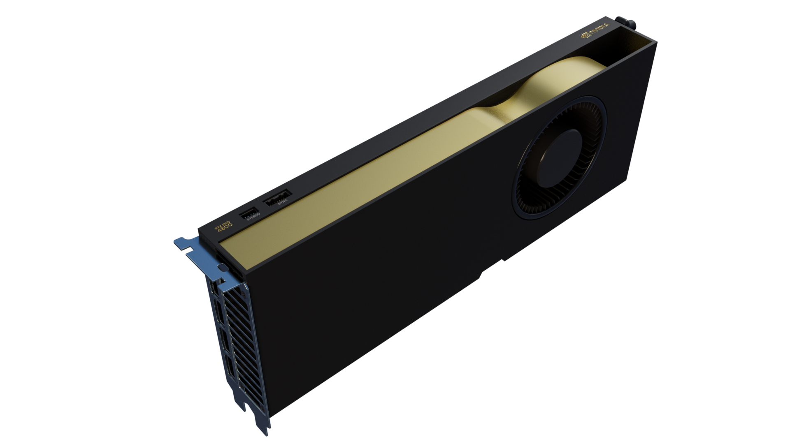
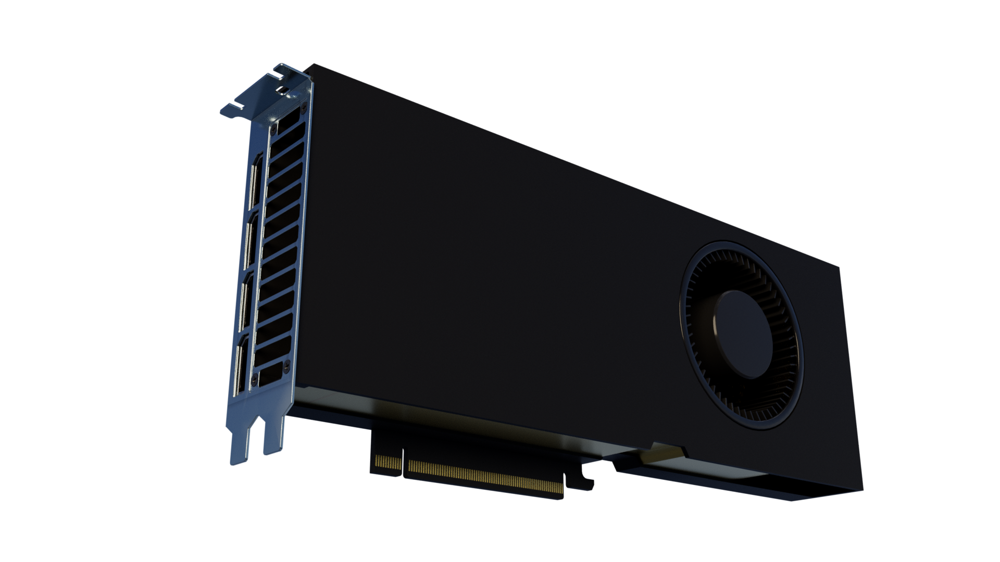
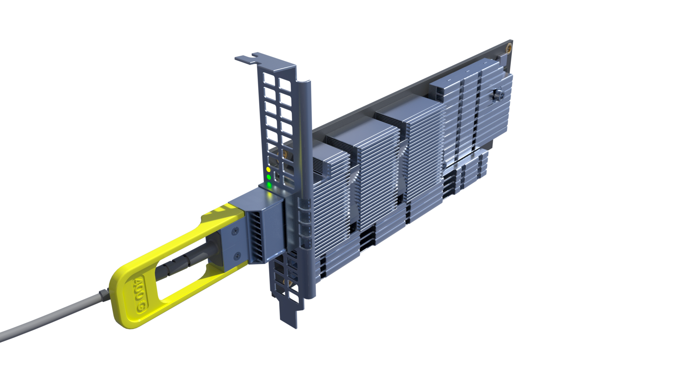
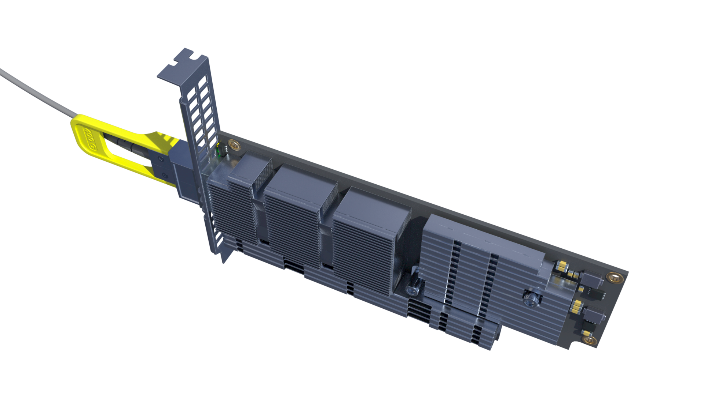
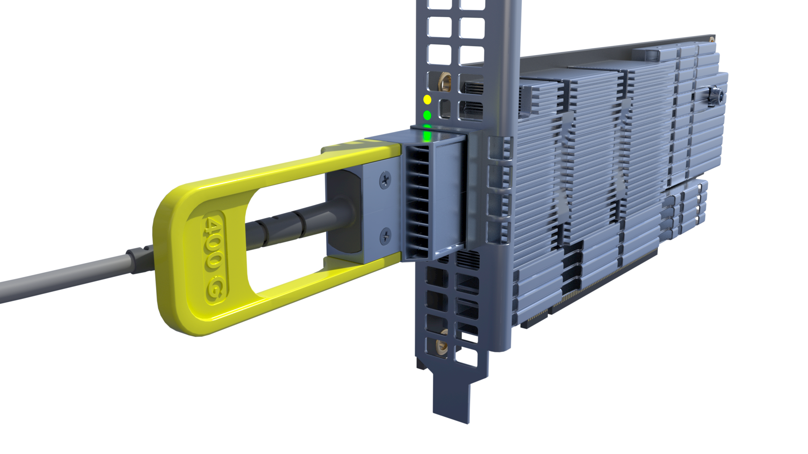
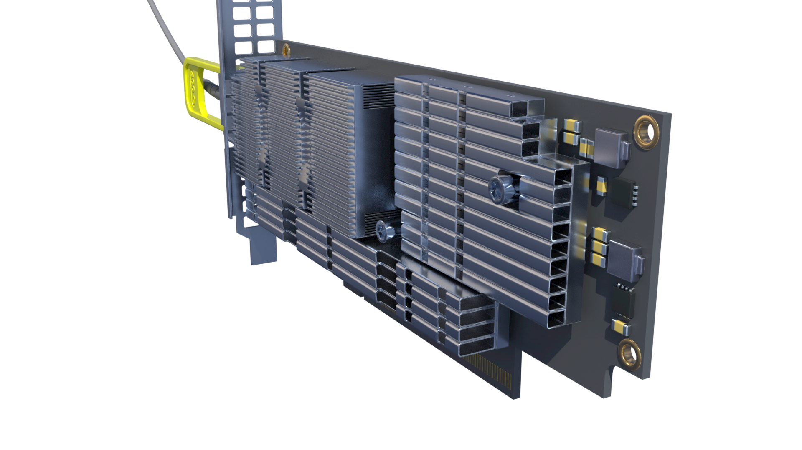

# Case 03: The AI Inference Refinery (Main Concept)

> [!NOTE]
> For rules regarding how this hardware is translated into 3D assets (Scale, Instancing, Kinds, Telemetry), refer to the [USD Architecture Guidelines](./usd_architecture/).

## 📋 High-Level Narrative

The project visualises an **Industrial-Scale AI Inference Farm**, designed to serve flagship Large Language Models (LLMs) like **NVIDIA Nemotron-3**.

Unlike a traditional "batch" render farm, this "Refinery" acts as a live machine that transforms electrical energy into digital "intelligence" (tokens). The showreel focus is on **Dynamic Scaling**: showing how the infrastructure physically responds to a sudden surge in global AI traffic.

## 🎯 The Scenario: "Viral Inference Surge"

1. **Incoming Load**: A massive spike in user requests hits the data centre.
2. **Sequential Ignition**: The Load Balancer/Scheduler cascades the activation of servers across 16 racks.
3. **Visual Delta**: The room transitions from a "Cold/Idle" state (Blue) to a "Heavy Load/Working" state (Orange-Red Heatmap).
4. **Airflow Reaction**: As nodes activate, cooling fans ramp up, creating visible turbulence (simulated in Houdini) that vibrates the overhead cabling and filters through the front meshes.

## 🖥️ Hardware Specification: Blackwell Rig GB203

To maximise **high-fidelity hardware visualisation for thermal/airflow storytelling**, the project uses a custom-designed **4U Air-Cooled Node** instead of standard rack-mount "fridges".

### Component List

| Component | Model / Detail | Justification |
| :--- | :--- | :--- |
| **Chassis** | **SilverStone RM44** (4U, E-ATX) | Industrial design with maximized front mesh for visible airflow simulation. Supports SSI-EEB boards. |
| **GPU Array** | **3× NVIDIA RTX PRO 4500 (GB203)** (32GB GDDR7) | Reduced from 4x to ensure physical fitment of the ConnectX-7 NIC and improved airflow. Rear power connectors eliminate cable clutter. |
| **CPU** | **AMD Ryzen Threadripper PRO 7975WX** (32C/64T) | High core count for independent task scheduling/preprocessing. |
| **RAM** | **512 GB DDR5-5600 ECC RDIMM** (8×64 GB) | Crucial buffer for large model weights. Optimized for **INT8 Quantization** (Nemotron-3 ~340GB). 8x64GB config maximizes the WRX90's 8-channel architecture without relying on unavailability of 128GB modules. |
| **Cooler** | **Noctua NH-D9 TR5-SP6** (4U) | Premium air-cooling solution that fits within 4U height constraints while providing visual detail for simulation. |
| **Motherboard** | **ASUS Pro WS WRX90E-SAGE SE** (SSI-EEB) | Massive connectivity for 4x GPUs and PCIe 5.0 speeds. |
| **PSU** | **be quiet! Dark Power Pro 13 1600W** (Titanium) | 1600W capacity handles the ~1400W peak load. 200mm length fits easily within the RM44's 255mm limit. |
| **Networking** | **ConnectX-7** (InfiniBand/400GbE) | Occupies the 7th (and final) PCIe slot. Essential for high-bandwidth RDMA in AI clusters. *See Network Constraint note below.* |

> [!NOTE]
> **Historical Config**: For a traditional *Render Farm* role, utilizing all 4 GPUs would be viable as rendering is less dependent on ultra-low latency inter-node communication (onboard 10GbE would suffice). However, the **AI Inference** role mandates the ConnectX-7 for RDMA, necessitating the 3-GPU tradeoff to free up a PCIe slot.

### 🛠️ Engineering Justification

#### 1. Power Analysis (TDP vs. PSU)

* **CPU Load**: Threadripper 7975WX (350W TDP) can peak at **~500W+** with PBO enabled under heavy inference preprocessing load.
* **Hardware Shift**: Dropping the 4th GPU reduces node power draw to **~1200W**, increasing PSU efficiency headroom to ~75% (sweet spot).
* **Verdict**: The **1600W Titanium PSU** provides ample headroom. The decision to use 3 GPUs + 1 NIC solves the physical "PCIe crowding" issue on the ASUS WRX90, ensuring every component has breathing room.

* **Front-to-Back Airflow**: The SilverStone RM44 is selected specifically for its mesh front. The 4U height allows for large, low-RPM intake fans that create a massive volume of air movement.
* **Connectors**: The RTX PRO 4500 (GB203)'s tail-end power connector is crucial. It eliminates the "cable clutter" above the cards typical of consumer GPUs, allowing laminar airflow over the backplates and through the CPU cooler.

#### 3. The 400G Network Constraint (PCIe Bottleneck)

* **The Problem**: A single ConnectX-7 400G (NDR) card requires `~100 GB/s` of bidirectional bandwidth to operate at true Full-Duplex 400G (400Gbps in *both* directions simultaneously). A single PCIe 5.0 x16 slot only provides `~64 GB/s`.
* **The Official Nvidia Solution**: The *Nvidia ConnectX-7 Adapter Cards User Manual* specifies the use of an **Auxiliary Connection Card**, tethered to the main NIC via two internal Cabline CA-II Plus harnesses (black and white cables). This bridges a second PCIe 5.0 x16 slot to double the bandwidth to `128 GB/s`.
* **The Physical Reality**: The ASUS Pro WS WRX90E-SAGE SE has exactly 7 PCIe slots. Three RTX PRO 4500 GPUs (dual-slot) occupy slots 1-6. The main ConnectX-7 card occupies slot 7. **There is no physical space for the Auxiliary Card.**
* **The AI Inference Justification**: This `64 GB/s` bottleneck is acceptable. Unlike a traditional core router requiring massive bidirectional throughput, an LLM Inference node has highly asymmetric traffic (small prompt input, larger token output, internal P2P over PCIe). The single slot's `64 GB/s` is more than enough to saturate the 400G link in a single direction (which requires `~50 GB/s`), making the omission of the Auxiliary Card an acceptable, calculated engineering trade-off for maximum GPU density.

#### 3. Strategic & Economic Positioning

* **"Acceptable Compute" Philosophy**: Designed for scenarios where **H100/B200 clusters are unobtainable** (due to allocation/cost), yet consumer hardware is insufficient.
* **The RAM Reality**: While the GPU/CPU combo is "budget-optimized" compared to DGX, the **512GB ECC RAM** requirement pushes the node price significantly higher due to the 2025-26 memory crisis. This choice acknowledges that for LLM inference, **VRAM is the engine, but System RAM is the fuel tank** — and fuel is expensive right now. This is a deliberate trade-off: spending on capacity where it matters most for model loading.
* **INT8 Optimization**: The 512GB capacity is engineered to perfectly host quantized flagship models (like Nemotron-3 340B INT8 ~340GB) + KV Cache + OS, avoiding the need for exotic and unobtainable 1TB (128GB DIMM) configurations.

#### 4. Financial Justification (TFLOPS per Dollar)

* **The Targeted Scaling Strategy:** The physical constraints of the 4U SilverStone RM44 chassis and the massive 1600W Titanium PSU were deliberately chosen to be **over-provisioned**. This shell acts as a platform capable of handling up to 900W of GPU power, allowing for seamless "drop-in upgrades" to flagship **RTX PRO 5000 (GB202)** cards for clients commanding extreme workloads or Multi-Instance GPU (MIG) support.
* **The Mathematical Reality:** While the platform *can* host the flagship models, the baseline **RTX PRO 4500 (GB203)** was explicitly selected for the foundational deployment due to an unmatched Performance-per-Dollar (FP32 TFLOPS/$) profile:
  * **RTX PRO 4500 (GB203)**: 53.8 TFLOPS @ $2,999 = **17.9 TFLOPS per $1,000**
  * **RTX PRO 5000 72GB (GB202)**: 65.0 TFLOPS @ ~$6,300 = **10.3 TFLOPS per $1,000**
* **The Scale of Savings**: Choosing the high-ROI RTX PRO 4500 saves ~$9,900 per 4U Node compared to the 72GB PRO 5000 setup. When scaled to a standard 16-rack "Inference Refinery" (160 nodes / 480 GPUs), this singular engineering decision yields a **massive saving of over $1.58 Million USD**.
* **Verdict**: The node architecture is built for maximum scalability (up to the RTX PRO 5000 limit), but initialized with the RTX PRO 4500 to guarantee peak economic efficiency for "Acceptable Compute" clusters. *(Note: The absolute top-tier RTX PRO 6000 was dismissed; its 600W TDP per card breaks the 1600W Node envelope, pushing the design out of the consumer-chassis paradigm entirely).*

## RTX PRO 4500 Hero Asset

*Procedural modeling & texturing of the Blackwell GB203 node.*

| | | | |
| :---: | :---: | :---: | :---: |
|  |  |  |  |
| *RTX PRO 4500 Blackwell - 01* | *RTX PRO 4500 Blackwell - 02* | *RTX PRO 4500 Blackwell - 03* | *RTX PRO 4500 Blackwell - 04* |

## ConnectX-7 Hero Asset

*Procedural modeling & texturing of the 400G NDR network interface card.*

| | | | |
| :---: | :---: | :---: | :---: |
|  |  |  |  |
| *ConnectX-7 - 01* | *ConnectX-7 - 04* | *ConnectX-7 - 07* | *ConnectX-7 - 08* |

### 5. Rack Integration Strategy ("The Glass Tube")

The choice of the **SilverStone RM44** (consumer chassis) over a barebone sled is driven by the **"Forced Flow"** containment architecture:

* **Sealed Containment:** The rack features a **hermetic Glass Door** and side panels.
* **Bottom Feed:** Cold air is injected from the plenum directly into the rack's **bottom slot** via high-pressure blowers.
* **Forced Trajectory:** Since the rack is sealed, the air has *no escape* but to pass **through** the mesh fronts of the RM44 nodes. This turns the entire rack into a pressurized wind tunnel, justifying the use of a chassis with a high-permeability front mesh.

## ⛓️ Connectivity & Data Flow

* **Intra-Node (P2P)**: High-speed memory sharing between the **3 GPUs** via PCIe 5.0. Visualised as rapid flashes within the server case.
* **Inter-Node (RDMA)**: Distributed memory pooling across the cluster. Visualised as "luminous flows" travelling through the overhead network trays between racks.
* **Deployment Scale**: 16 Racks (8 vs 8 arrangement). 160 Nodes total (480 Blackwell GPUs).
