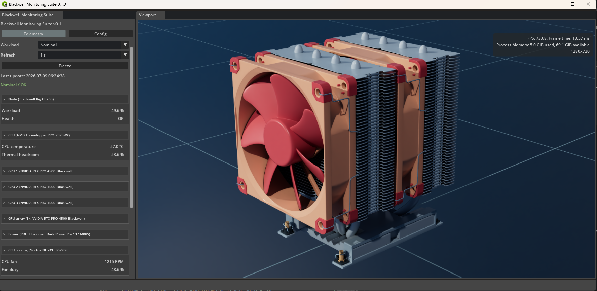
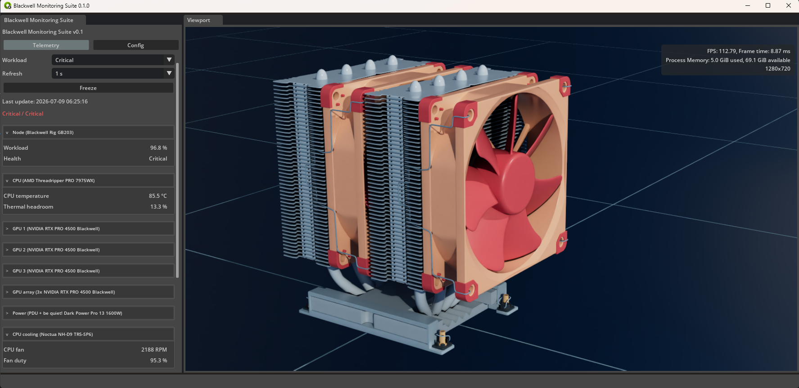

# Blackwell Monitoring Suite

This directory anchors the Blackwell Monitoring Suite source tree for the Case
03 tech pack.

The application layer consumes the USD/VDB asset package and owns the
interactive runtime experience: viewport presentation, status UI, synthetic
telemetry, operational state switching, and scene-level review tools.

Use `start_bms.bat` from this directory to launch the current local Kit runtime
when a built Omniverse Kit App Template release is available.

This layer is part of the Case 03 tech pack. The tech pack includes the
documentation, USD contracts, asset packaging rules, validation tools,
development helpers, and the Blackwell Monitoring Suite runtime.

## Runtime Preview

Blackwell Monitoring Suite 0.2.0 combines interactive Omniverse asset review,
the Stage 3 synthetic telemetry provider, workload-state controls, and Stage 4
telemetry-driven CPU fan motion.

| Nominal workload | Critical workload |
| :---: | :---: |
|  |  |
| *Nominal runtime telemetry and Noctua asset review* | *Critical workload thermal and cooling response* |

## Boundary

- `docs/` explains the architecture, contracts, and implementation decisions.
- `assets/_external/` contains the heavy hydrated assets outside version
  control.
- `configs/blackwell_monitoring_suite.toml` holds the current runtime
  asset and lighting config.
- `src/blackwell_monitoring_suite/configs/telemetry_provider.toml` holds the
  packaged synthetic telemetry targets, ranges, jitter, and cadence.
- `tools/mcp/` provides a small NVIDIA Omniverse USD/Kit MCP helper for
  development-time API lookup.
- External NVIDIA repositories such as `kit-usd-agents` remain outside this
  repository and are used as development references/tooling.
- A locally generated NVIDIA Omniverse Kit App Template may be used as a
  read-only implementation reference for app structure, extension layout,
  build/launch workflow, startup/playback/controller patterns, and future
  runtime viewer architecture. No local reference path is part of the public
  runtime contract.

Blackwell Monitoring Suite is the runtime validation layer for the Case 03
content package. Do not treat the local template folder as authored Case 03
content, and do not mix USD/VDB assets, documentation, or project source into
that folder as part of the BMS runtime package.

Heavy USD, VDB, texture, and HDRI payloads remain under `assets/_external/`.
Application modules may reference those files through relative config paths, but
they must not copy those assets into this source tree.

The Stage 2 look-review baseline uses
`assets/_external/hdri/kloofendal_48d_partly_cloudy_puresky_4k.exr` by default
and applies it through a transient `/BMS_Runtime/Lighting` session-layer dome
light. The Config panel can hide the HDRI background from the primary viewport
while keeping the dome light active.

The Stage 3 runtime adds a synthetic node telemetry provider and a shared
`Telemetry` / `Config` sidebar. The provider runs independently from the Kit
timeline and asset-loading lifecycle, publishes a latest-only snapshot, and
supports `Idle`, `Nominal`, `Surge`, and `Critical` workload targets. The
Telemetry tab samples that state at `1`, `5`, `10`, or `30` second intervals
and can freeze the displayed snapshot without stopping the provider. Metric
groups use collapsible, visually separated headers; per-GPU detail starts
collapsed while node-level summaries remain visible. The update label includes
the local ISO date and time, and temperature values use `°C`. Both tabs reserve
a permanent scrollbar gutter so their content width does not shift.
The Config tab uses the same collapsible treatment for Asset, Lighting, Grid,
Camera, and Telemetry provider controls.
The Config tab includes a compact telemetry-provider editor for global cadence
defaults and per-mode numeric target, jitter, and safe-range tuning. Changes
are saved to the separate ignored `telemetry_provider.local.toml` override.
The editor represents a `4 modes x 20 numeric settings` matrix: the `Mode` and
`Metric` selectors choose one matrix entry, whose target, jitter, minimum, and
maximum values are then edited. `health_state` is not numeric, and
`throttling_active` is derived rather than edited directly. The three GPUs
share six configurable baselines for temperature, memory junction, hotspot,
power, blower speed, and allocated memory.
The provider applies per-card position bias and independent jitter; node-level
GPU maxima and total power are derived automatically.
Per-card memory use also has independent jitter, a hard 32 GB limit, derived
utilisation, and a derived 96 GB node total.
The Telemetry tab also includes a ConnectX-7 Network group with fixed link
state/speed and workload-driven traffic, temperature, error-rate, and RDMA
session values.
Telemetry section titles identify the corresponding node hardware. Cooling
includes independent RPM channels for three ARCTIC BioniX P120 front-intake
fans and two ARCTIC P8 Max rear-exhaust fans.
The Power section uses synthetic PDU outlet input as its source value and
derives estimated PSU output, platform residual, conversion loss, PSU
temperature, and PSU load. The temperature estimate uses explicit inlet
temperature and thermal-resistance assumptions; it is not presented as a
hardware sensor reading. The provider keeps PDU input above the CPU, GPU, and
minimum platform demand so the displayed power balance remains consistent.
Thermal headroom is derived from CPU temperature, inlet temperature, and the
configured CPU temperature limit.
Critical-mode throttling is generated as short stateful episodes rather than a
per-tick random flag. Episode probability is driven by CPU temperature, maximum
GPU hotspot temperature, and PSU load, with a recovery interval between
episodes.

Stage 4 adds telemetry-driven CPU fan motion. The motion controller first
resolves the fan axis from mesh topology, then prefers an authored rotation
`Xform` when the resolved axis passes close to that prim's local origin. For
example, a fan whose topology resolves to a local `Z` axis can use its authored
parent `Xform` directly when the resolved pivot has near-zero `X` and `Y`
offsets; the `Z` value may differ because any point on that axis is a valid
rotation centre. If the exported hierarchy is missing or off-axis, the runtime
falls back to a Session Layer pivot stack shaped as
`translate(pivot) -> rotate(axis) -> translate(-pivot)`.

Future server-level fan assets should repeat this pattern: each rotating blade
or blower wheel should sit under its own stable parent `Xform`, with that
parent origin on the physical rotation axis. The runtime still validates the
axis from topology, so exported pivots are used as the fast path rather than as
blind trust.
